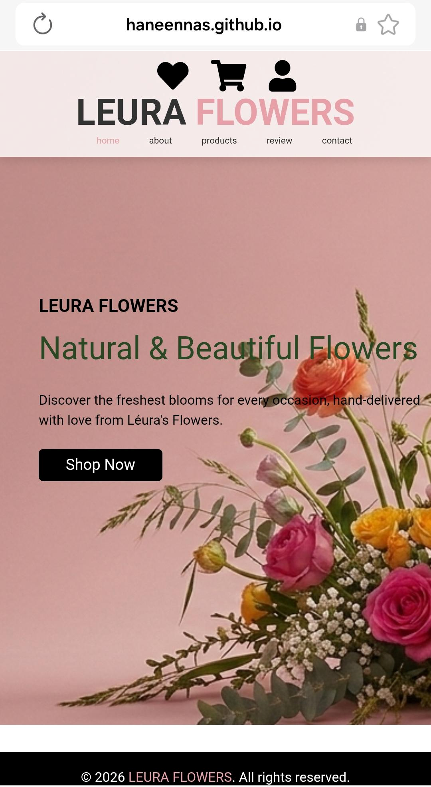
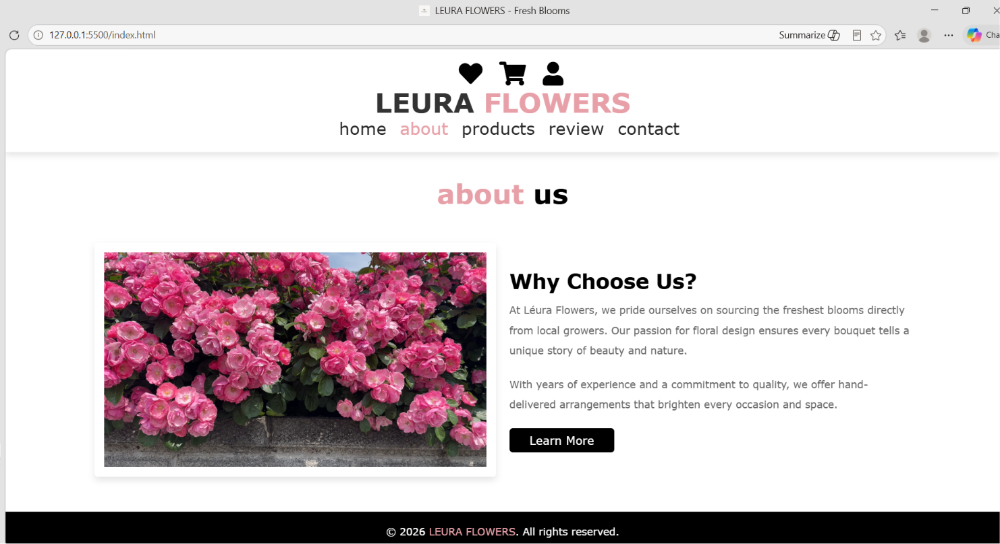
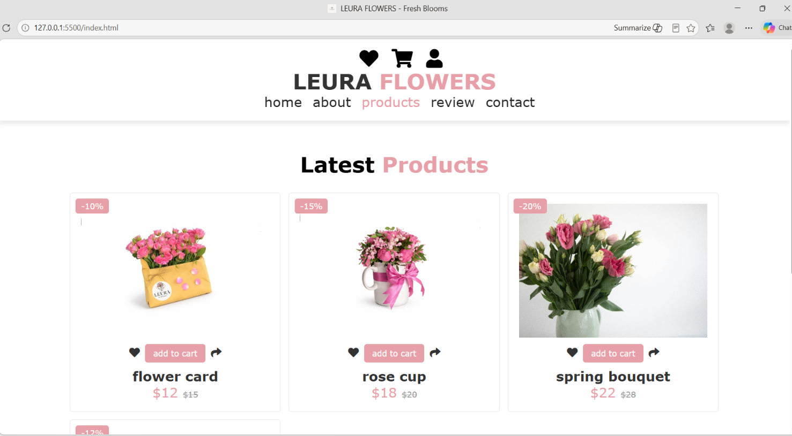
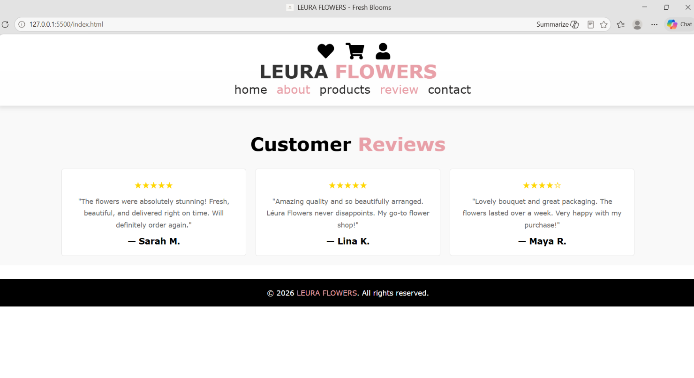
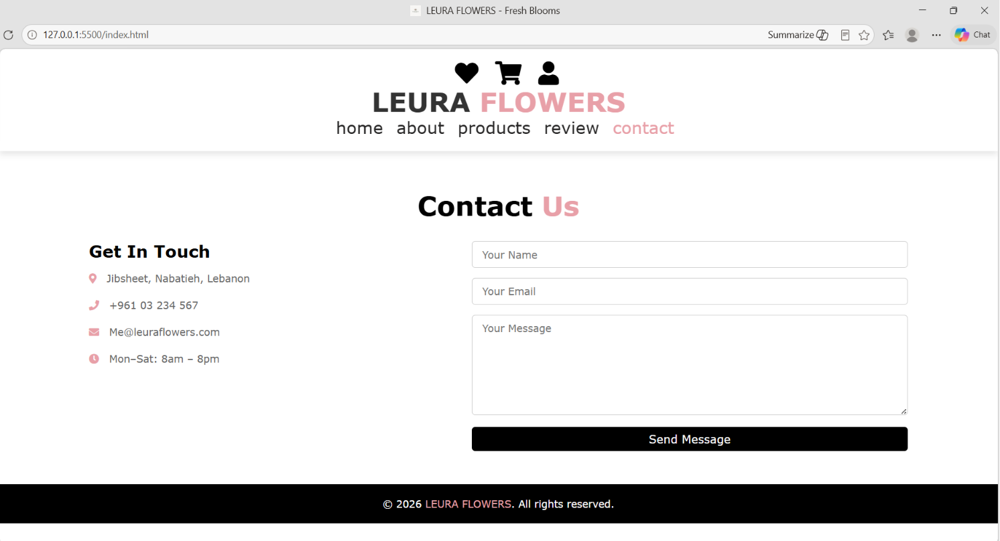

📋 Project Description

Léura Flowers is a fully responsive front-end website for a local flower shop based in Lebanon. We built it as a single HTML file using **React 18 via CDN** and **Babel Standalone** — no npm, no webpack, just open the file and it works.

The site has 5 sections: **Home**, **About**, **Products**, **Reviews**, and **Contact**. We used React's useState and useEffect hooks for page navigation and form state, with all styling in plain CSS.

⚙️ Setup Instructions

1. Download or clone the project
2. Make sure all files are in the **same folder** as 'index.html':

leura-flowers/
│
├── index.html
├── home.jpg
├── about-vid.mp4
├── product 1.jpeg
├── product 2.jpeg
├── product 3.jpg
└── product 4.jpg

3. Open 'index.html' in your browser ✅

📸 UI Screenshots

🏠 Home

ℹ️ About

🛍️ Products

⭐ Reviews

📩 Contact

Made by : Hanin Ali Astalani & Lara Bahmad.
